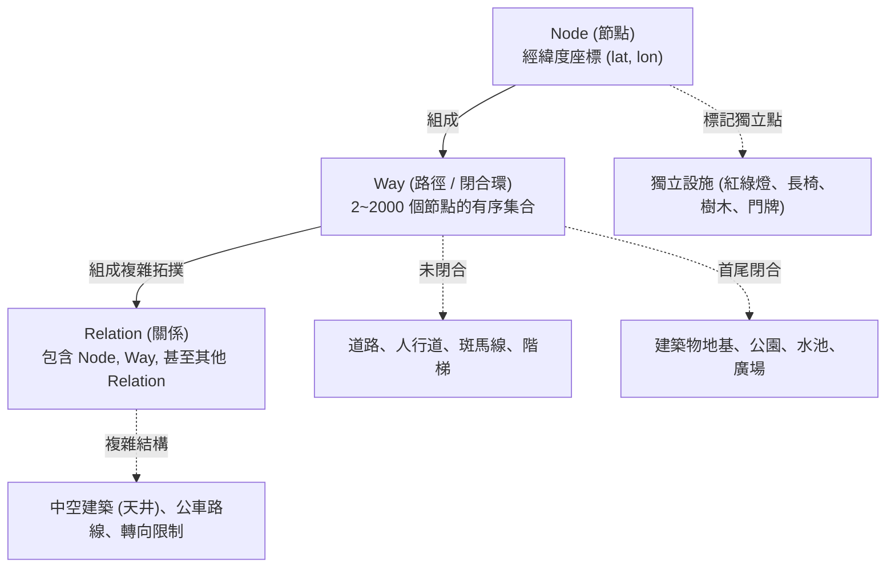
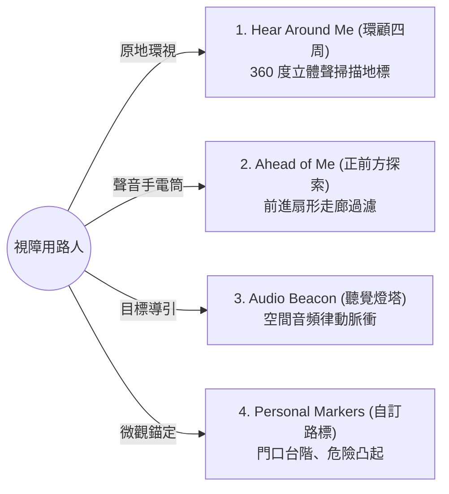

# OSM (OpenStreetMap) 開放街圖與 VoiceVista (微軟 Soundscape) 深度架構研究全書

> 本文件為 NMap Explorer 專案對於 **OpenStreetMap (OSM) 資料體系** 與 **VoiceVista (原微軟 Soundscape 開源專案) 空間聽覺導航架構** 的完整研究與技術對標手冊。

---

## 導讀：為什麼我們必須同時了解 OSM 與 VoiceVista？

視障朋友走在馬路上，大腦需要兩樣最核心的支撐：
1. **「全世界最精細的地圖數據」**：不能只有大馬路，還要有哪裡有導盲磚、哪裡有人行道緣石高低差、哪裡的紅綠燈有鳥鳴叫聲、哪裡有變電箱擋路。這就是 **OpenStreetMap (OSM)**。
2. **「最符合大腦直覺的聽覺呈現方式」**：不能像傳統車用導航那樣每隔十秒囉嗦地說「請在前方向左轉」，而是要把資訊轉化為空間立體聲與聽覺燈塔，讓視障者用耳朵「看見」周遭環境。這就是 **VoiceVista (源自微軟 Soundscape)**。

---

# 第一篇：OpenStreetMap (OSM) 資料體系與無障礙微觀拓撲

## 1.1 OSM 的三大核心幾何基元 (Core Primitives)

OpenStreetMap 的底層結構非常純粹且優雅，由三種基本元素組成：



### 1. `Node` (節點)
- **定義**：地球表面上單一的經緯度點（WGS84 座標系）。
- **用途**：
  - 作為獨立地標點（如：紅綠燈 `highway=traffic_signals`、公車站牌 `highway=bus_stop`、樹木、長椅、門牌號碼）。
  - 作為構成線段的頂點。

### 2. `Way` (路徑 / 折線 / 多邊形)
- **定義**：由 2 到 2000 個 Node 組成的有序列表。
- **類型判別**：
  - **開放路徑 (Open Way)**：首尾節點不相連。用於表示道路 (`highway=primary`)、人行道 (`highway=footway`)、河流、圍牆。
  - **閉合路徑 (Closed Way / Area)**：第一個節點與最後一個節點座標完全相同。
    - 若帶有 `building=*`、`amenity=*`、`landuse=*` 等面屬性標籤，OSM 自動視為**多邊形面 (Polygon / Area)**。
    - 若帶有 `highway=roundabout`（圓環），則視為封閉的單行道路。

### 3. `Relation` (關係)
- **定義**：用來定義多個元素之間的邏輯或空間關聯。
- **核心類型**：
  - `type=multipolygon`：處理帶有天井、中空甜甜圈造型的複雜建築，或由多段多邊形拼成的島嶼（定義 `outer` 外環與 `inner` 內環）。
  - `type=route`：大眾運輸路線（例如公車 307 路徑、台北捷運板南線）。
  - `type=restriction`：交通禁轉限制（禁止左轉、禁止迴轉）。

---

## 1.2 視障行動與微觀無障礙標籤體系 (Accessibility Tagging)

OSM 是全球唯一被視障者與身障團體廣泛深度標註的開放地圖。在 OSM 中，視障導航最關心的標籤矩陣如下：

### 一、 行人通道與人行道鋪面 (Pedestrian Infrastructure)
| 標籤鍵值 (Key=Value) | 意義與生活情境 | NMap / 導航應用方式 |
| :--- | :--- | :--- |
| `highway=footway` | 獨立行人步道（無車輛通行的純步行走廊） | 優先規劃路徑，完全隔離汽機車雜訊 |
| `footway=sidewalk` | 緊鄰大馬路路側的人行道 | 判定使用者行走在人行道上，自動吸附至路側 |
| `sidewalk=both / left / right / no` | 標記於車行道上，說明該馬路哪一側具備實體人行道 | 若為 `no`，立即向視障者發出「注意車流，本路段無實體人行道」警告 |
| `surface=*` | 地面材質（`paving_stones` 磚面、`asphalt` 柏油、`concrete` 水泥、`gravel` 碎石） | 透過白杖回聲與腳感回饋，預告地面鋪面變化 |
| `smoothness=*` | 平整度（`good`, `intermediate`, `bad`, `very_bad`） | 警告是否有凹凸不平、坑洞容易絆倒 |
| `incline=*` | 坡度（例如 `5%`, `12°`, `up`, `down`） | 預警前方上坡或下坡 |
| `highway=steps` | 樓梯/階梯（極度關鍵！） | 嚴格警告前方有階梯；結合 `step_count=*`（階數）與 `handrail=*`（扶手）提示 |

### 二、 斑馬線與過馬路設施 (Crossings & Kerbs)
| 標籤鍵值 (Key=Value) | 意義與生活情境 | 聽覺反饋與防護 |
| :--- | :--- | :--- |
| `highway=crossing` | 行人穿越道（斑馬線） | 路口生命線狀態機的核心節點 |
| `crossing=zebra / marked` | 有劃設斑馬線標線 | 告知「前方有斑馬線」 |
| `crossing=traffic_signals` | 附設行人紅綠燈的過馬路路口 | 提示「路口有紅綠燈，啟動號誌相機/震動輔助」 |
| `crossing=uncontrolled` | 無紅綠燈的過馬路點（閃黃燈或無號誌） | 🔴 高危警示：短促提醒「無號誌斑馬線，注意雙向來車」 |
| `kerb=flush / lowered / raised` | 人行道邊緣石高度（平整 / 斜坡斜下 / 凸起段差） | 盲杖探測前預告：`flush` 齊平、`raised` 有段差階梯 |
| `tactile_paving=yes / no` | **導盲磚 (盲道)** | 提示地面有無導盲磚導引 |

### 三、 視障有聲號誌與觸覺按鈕 (APS - Acoustic Pedestrian Signals)
| 標籤鍵值 (Key=Value) | 意義與生活情境 | 台灣在地特色對應 |
| :--- | :--- | :--- |
| `traffic_signals:sound=yes` | 設有視障有聲號誌 (APS) | 提前 22 公尺預告，引導聆聽鳥鳴或蟋蟀聲 |
| `traffic_signals:sound=chirp` | 南北向鳥鳴聲（布榖鳥/叫聲） | 台灣常見規範：南北向為布穀聲 |
| `traffic_signals:sound=cuckoo` | 東西向蟋蟀聲/布榖聲 | 台灣常見規範：東西向為蟋蟀或連續嗶嗶聲 |
| `traffic_signals:vibration=yes` | 行人按鈕盒下方帶有**震動箭頭** | 提示視障者觸摸號誌桿上的觸覺震動銘牌 |
| `button_operated=yes` | 行人觸動號誌（需手動按鈕才會變綠燈） | 提示「請尋找並按下行人號誌按鈕」 |

### 四、 人行道安全地雷：障礙物 (Sidewalk Hazards & Barriers)
| 標籤鍵值 (Key=Value) | 意義與生活情境 | 防撞警示優先級 |
| :--- | :--- | :--- |
| `barrier=bollard` | 車阻柱（人行道出入口防機車的金屬/石製矮柱） | 盲杖極容易卡住或撞擊小腿，$\le 6$ 米發出提示 |
| `man_made=street_cabinet` | 變電箱（中華電信/台電箱體，經常佔據人行道半邊） | 🔴 Priority 1 最高優先防撞警告 |
| `emergency=fire_hydrant` | 消防栓（低矮金屬突出物，夜間極度危險） | 🔴 Priority 1 最高優先防撞警告 |
| `power=pole` | 電線桿（水泥柱或木桿） | 預告人行道障礙 |

### 五、 室內微地圖 (Simple Indoor Tagging - SIT)
| 標籤鍵值 (Key=Value) | 意義 | 應用領域 |
| :--- | :--- | :--- |
| `indoor=room` | 實體封閉房間 | 車站服務台、無障礙廁所、超商 |
| `indoor=corridor` | 室內走廊通道 | 地下街地下道、轉乘通道 |
| `indoor=door` | 門扇位置 | 自動門、推拉門、旋轉門（旋轉門對導盲犬極具挑戰） |
| `level=*` | 所在樓層（`0`=地面層 1F, `1`=2F, `-1`=B1, `-2`=B2） | 結合氣壓計與 SRTM 進行樓層垂直錨定 |
| `entrance=yes / main` | 建築物出入口（大門、無障礙側門） | 導航終點精確對準「大門門口」，而非建築中心點 |

---

## 1.3 Overpass API 空間查詢架構

Overpass API 是 OSM 官方與社群提供唯讀結構化查詢的空間資料庫引擎。
NMap Explorer 與 VoiceVista 的生態系（如 Overscape）皆依賴 Overpass QL。

### Overpass 核心語法範例 (NMap Explorer 用法)：
```c
[out:json][timeout:5];
(
  // 1. 抓取方圓 200 米內的行人步道與道路網絡
  way["highway"](around:200, 25.0335, 121.5645);
  
  // 2. 抓取斑馬線與紅綠燈節點
  node["highway"="crossing"](around:200, 25.0335, 121.5645);
  node["highway"="traffic_signals"](around:200, 25.0335, 121.5645);
  
  // 3. 抓取建築物閉合多邊形輪廓 (包含門牌號碼)
  way["building"](around:120, 25.0335, 121.5645);
  
  // 4. 抓取人行道障礙物 (車阻柱、變電箱)
  node["barrier"="bollard"](around:80, 25.0335, 121.5645);
  node["man_made"="street_cabinet"](around:80, 25.0335, 121.5645);
);
// 遞歸輸出節點拓撲幾何
out body;
>;
out skel qt;
```

---

# 第二篇：VoiceVista (微軟 Soundscape) 的聽覺導航哲學與資料架構

## 2.1 什麼是 VoiceVista？微軟的「聲景 (Soundscape)」哲學

微軟研究院（Microsoft Research）自 2014 年起與英國導盲犬協會（Guide Dogs UK）合作，歷時八年研發出 **Soundscape**，並於 2022 年底正式以開源模式釋出，隨後由盲人獨立開發者 Dr. Jianfeng Wu 接棒發展出 **VoiceVista**。

```
                    【傳統導航 (Google Maps)】
                    「100 公尺後向右轉」
                             ↓
                    視障者淪為「被動指令接收者」
                    缺乏對周遭環境的情境認知
                             ↓
                    一旦 GPS 飄移 ➔ 徹底迷失方向
```
vs
```
                    【聲景導航 (VoiceVista / Soundscape)】
                    在遠方咖啡廳放一個「虛擬發聲燈塔 (Audio Beacon)」
                    在右邊路口傳來「大忠街」的空間立體聲
                             ↓
                    視障者用耳朵感知「空間 3D 音場」
                    在腦海中自主建構「心智地圖 (Mental Map)」
                             ↓
                    掌握完全的自主性與行動尊嚴
```

---

## 2.2 VoiceVista 的四大核心聽覺互動模式



### 1. Hear Around Me (環顧四周 360° 掃描)
- **觸發方式**：點擊按鈕或耳機雙擊手勢。
- **播報機制**：
  - 系統從正前方 12 點鐘開始，順時針方向（12點 ➔ 3點 ➔ 6點 ➔ 9點）依序播報方圓 50 公尺內的地標、路口與設施。
  - **聲音空間化**：當播報右側的超商時，語音完全從右耳傳出；播報後方的路口時，語音經過聲學濾波產生「身後感」。
  - 目的：讓視障者到達陌生路口時，花 3 秒鐘迅速建立全域方位感。

### 2. Ahead of Me (前方聲音手電筒)
- **概念**：如同拿著一支發出聲納的手電筒。
- **過濾機制**：
  - 沿著手機目前真北朝向（或頭戴裝置方向），篩選前方 **30°~45° 扇形錐形區域**。
  - 自動排除身後 180° 與橫向兩側遠處的干擾。
  - 由近而遠依序報讀：「前方 8米 全家便利商店」、「前方 15米 大忠街路口」。

### 3. Audio Beacon (虛擬聽覺燈塔 / 音頻信標)
- **這是 Soundscape 最震撼的設計**。
- **運作方式**：
  - 使用者在想去的目的地（例如淡水捷運站 1 號出口）插上一支「虛擬燈塔」。
  - 手機會在該地理座標持續播放極具律動感的短促音效（Ping / Chime 脈衝，約每 1.5 秒響一次）。
  - **音效特性**：
    - **方向性**：採用 HRTF 3D 音訊。如果捷運站在左前方 10 點鐘，聲音就清晰地從左前方傳來。
    - **距離感**：越靠近目的地，脈衝頻率加快、音量變清晰；遠離時聲音變低沉且帶有距離衰減。
    - **到達慶祝 (Arrival Chime)**：當走進目標 3 公尺半徑內，播放歡快的抵達和弦音效，任務完成。
  - 視障者**不需要任何路徑指示**，只要白杖確認腳下安全，身體順著聲音的方向走，就能自然穿過廣場或騎樓抵達目標！

### 4. Personal Markers & Routes (個人路標與循跡路線)
- **實務痛點**：商業地圖永遠不會記載「這間咖啡廳的門把在左邊」、「這家醫院的無障礙電梯在轉角後第三根柱子」。
- **VoiceVista 解決方案**：
  - 使用者走到特定位置時，輕按一下「標記此地 (Drop Marker)」，錄製個人語音或文字（例如：「常跌倒的台階起點」）。
  - 下次經過該地點 5 公尺內時，耳機會自動空間化播報該標記。
  - 多個標記可串連為「個人安全步行軌跡 (Marker Trail)」。

---

## 2.3 空間音訊與心理聲學 (HRTF 3D Audio)

VoiceVista 的聽覺沉浸感建立在心理聲學（Psychoacoustics）上：

```
                【人類大腦判斷聲音方向的兩大物理線索】
    
    1. 雙耳時間差 (ITD, Interaural Time Difference):
       右邊來的聲音，先到達右耳，約 0.6 毫秒後才到達左耳。
       大腦能解析微秒級的時間延遲來定位水平方位。
    
    2. 雙耳強度差 (IID, Interaural Intensity Difference):
       高頻聲音波長短，頭顱會遮擋聲音（聲影效應 Head Shadowing），
       右邊來的聲音在右耳音量大，左耳音量顯著衰減。
```

### 耳機 vs 手機擴音器的現實折衷
* **戴耳機（開放式 / 通透模式）**：
  - HRTF 3D 空間音訊效果完美，視障者如同被空間聲音環繞。
* **不戴耳機（街頭擴音器使用 - 台灣多數視障用路人情境）**：
  - ⚠️ **殘酷現實**：手機底部的單一揚聲器**無法產生 HRTF 雙耳立體聲效果**！
  - 這正是為什麼 VoiceVista 在許多不戴耳機的視障朋友手機上「水土不服」的原因。
  - **NMap Explorer 的突破解法**：不戴耳機時，自動將 3D 音效退回為**「極簡鐘點方位 (Clock Positions) + 極短促專屬樂器圖標 (Earcons, ~100ms)」**，用「聲音反射神經」取代單聲道喇叭無法呈現的立體聲。

---

# 第三篇：OSM 與 VoiceVista 結合在 NMap Explorer 的深度演進與超越

## 3.1 三方深度對標分析矩陣

| 評比維度 | OpenStreetMap (原生) | VoiceVista / Soundscape | NMap Explorer (本專案) |
| :--- | :--- | :--- | :--- |
| **資料架構** | 全球去中心化地圖資料庫，標籤極為豐富但各國標註密度不一 | 透過雲端伺服器 (PostGIS/Overscape) 下載 OSM 圖磚 | **三重混合架構**：離線 SQLite (`overture_places.db` + `gov_places.db`) + 官方 OSM XML API + Overpass 鏡像平行競速 |
| **網路依賴度** | N/A (僅為資料庫) | 🔴 高度依賴網路。斷網時地圖全白、無法探索 | 🟢 **100% 離線可用**。內建 47 萬筆台灣店家與全台 SRTM3 3D 地形高程庫 |
| **導航模式** | 靜態幾何圖形 | 虛擬聽覺燈塔 (Audio Beacon) + 360° 空間探索 | 前進走廊動態篩選 + 路口到達三態狀態機 (APPROACHING/PASSING/LEAVING) + 聽覺燈塔 |
| **播報風格** | 無（純資料） | 偏多。遇繁華街道時語音頻繁播報容易疲勞 | 🟢 **四級降序優先鏈 (Priority Chain)** + 門牌自然錨定 + 同側聚類打包（減少 70% 贅字） |
| **都市峽谷容錯** | 無 | 遇到高樓 GPS 跳躍時，聲音會跟著在左右馬路瞬移 | 🟢 **二維步行卡爾曼濾波** + 步伐波峰檢測 + 騎樓 PDR 航位推算 + ZUPT 零速修正 |
| **等紅綠燈輔助** | 僅標註有無紅綠燈標籤 | 無視覺號誌感知 | 🟢 **CameraX 即時號誌相機** + 小綠人閃爍雙拍心跳震動 + 夜間反光過濾 |
| **建築物感知** | `building=*` 多邊形頂點 | 僅視為點地標 (POI) | 🟢 **純 Python 射線交點法 (PNPOLY)** 精準判定是否身處大樓內部，自動觸發進出狀態機與 Earcons |

---

## 3.2 NMap Explorer 對 VoiceVista 精髓的吸收與再升級

NMap Explorer 在吸納 VoiceVista 核心價值的同時，針對台灣特有的街頭環境（騎樓、大樓密集、高架橋、密集巷弄、擴音器使用習慣）進行了革命性昇華：

### 1. 將 VoiceVista 的「Ahead of Me」昇華為「前進路徑走廊與同側聚類打包」
- **VoiceVista 原版**：前方 45° 內的所有店家全部個別唸出來，一條夜市街可能連續唸 20 家，耳朵瞬間麻痺。
- **NMap Explorer 升級**：
  - 限制前方 2.0~18.0 米、橫向 $\le 14$ 米的行走視錐。
  - **聚類打包**：同側角度差 $\le 28^\circ$ 且距離差 $\le 6.0$ 米的多家店家，自動合併為：
    > `2點鐘 8米：全家 (205號)、路易莎咖啡`
  - 播報長度壓縮在 0.8 秒內完成，保留聽覺頻寬給周遭真實車流。

### 2. 將 VoiceVista 的「Intersection Callout」昇華為「路口精準三態與連續巷口接力」
- **VoiceVista 原版**：靠近路口時只會念一次「Intersection with Zhongzheng Rd」，使用者不知道何時踏上馬路、何時到達對面。
- **NMap Explorer 升級**：
  - 劃分精準三態：
    - `APPROACHING` (8~25m)：以鐘點走向預告交會路段（`左 10點鐘 大忠街，右 2點鐘 大忠街`）。
    - `PASSING` (< 6m)：短促提示過馬路，若對向接續道路變更則報讀 `📍 正通過路口，直行接【中正路】。`。
    - `LEAVING` (6~18m)：提示 `📍 沿著【目前路名】繼續前進。`，具備 45 秒獨立防抖冷卻。
  - **連續巷弄接力**：若前方相距 $\le 12$ 米內有連續巷口，預告全貌並在跨過第 1 條巷子瞬間即時接力報讀。

### 3. 將 VoiceVista 的「耳機 3D Audio」拓展為「雙模態聽覺圖標 (Earcons First)」
- **手機擴音器模式**：以極短促樂器音效（超商叮噹聲、餐廳木質敲擊聲、大樓進入向上音階、大樓走出向下音階）取代長篇大論。
- **耳機模式**：保留 Web Audio API (HRTF PannerNode) 立體環繞定位，與真北磁偏角校正完美連鎖。

---

## 3.3 專案核心架構藍圖 (Future Architecture Blueprint)

基於對 OSM 與 VoiceVista 的全方位理解，NMap Explorer 後續可直接導入三大全新旗艦模組：

```
                       【NMap Explorer 核心大腦】
                                  │
         ┌────────────────────────┼────────────────────────┐
         ▼                        ▼                        ▼
【AudioBeaconManager】    【OsmAccessibilityDecoder】  【SimpleIndoorEngine】
  虛擬聽覺燈塔導引系統         無障礙微觀拓撲解碼器          地下街/捷運室內導航
  - 3D 空間律動脈衝            - 導盲磚 (tactile_paving)     - 樓層空間網格 (level)
  - 步頻調諧音高衰減          - 緣石高差 (kerb:flush)       - 室內走廊 (corridor)
  - 到達慶祝音效 (Arrival)     - 車阻柱/變電箱防撞雷達       - 出入口大門 (entrance)
```

1. **`AudioBeaconManager` (虛擬聽覺燈塔引擎)**：
   讓視障者可以在搜尋到特定店家或自訂地點後，一鍵開啟「聽覺信標」。手機便在該座標持續播放空間脈衝聲，提供完全免轉彎提示的自由尋向體驗。
2. **`OsmAccessibilityDecoder` (無障礙微觀拓撲解碼器)**：
   在現有 `world_model.py` 中擴充專屬解析器，將 OSM 中的 `kerb`、`tactile_paving`、`barrier=bollard`、`handrail` 轉化為觸覺震動或微型警告音。
3. **`SimpleIndoorEngine` (室內微地圖導航器)**：
   利用 OSM 的 Simple Indoor Tagging 規範，讓視障者在進入台北地下街或捷運站等地下複雜巨構時，能清楚知道洗手間、電梯與各個出口的精確室內方向。

---

## 結論

OpenStreetMap 是全世界最強大的**空間事實資料庫**，而 VoiceVista 則是無障礙領域中**最懂視障者心理聲學的聽覺設計典範**。
NMap Explorer 成功地站在這兩大巨人的肩膀上，透過「純 Python 幾何防護」、「離線資料庫快取」、「卡爾曼姿態融合」與「四級優先省話狀態機」，打造出真正為視障朋友量身定制、能在真實複雜街頭穩定保命的頂級導航系統。
