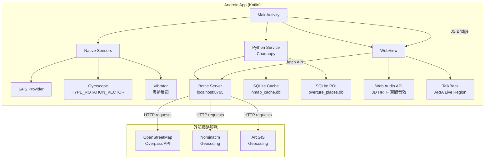
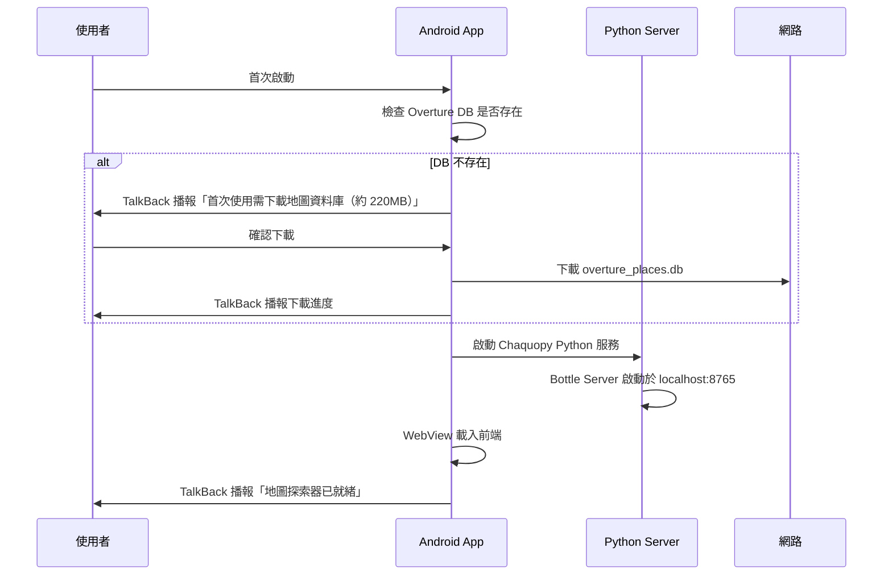
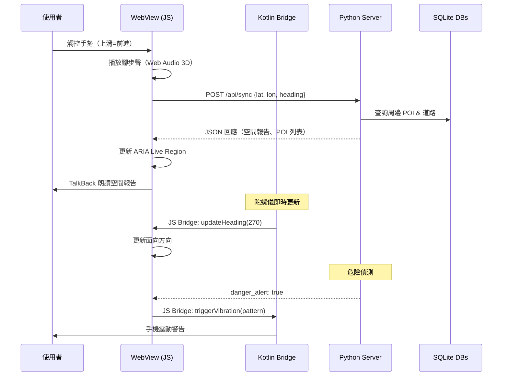

# NMap Android APK 轉換計畫書

> **專案**：nmap 視障者真實地圖世界探索器 → Android APK  
> **日期**：2026-08-11  
> **狀態**：待確認

---

## 1. 需求確認摘要

| 項目 | 決策 |
|------|------|
| 技術路線 | WebView 封裝 + Chaquopy 嵌入 Python 後端 |
| 執行模式 | 全部在手機端執行（離線優先） |
| 最低 Android 版本 | Android 12 (API 31) |
| Overture 資料庫 | 首次啟動時下載到手機本地 |
| TalkBack 支援 | 完整支援（最高優先需求） |
| 3D 空間音效 | 完整保留 |
| 操控方式 | 觸控手勢為主 |
| GPS 整合 | 使用手機 GPS 作為起點 |
| 原生功能 | GPS + 震動反饋 + 陀螺儀方向感應 |
| 模擬引擎 | 暫不移植（只保留核心探索） |
| 語系 | 繁體中文，預留多語系架構 |
| 發佈方式 | 先產生 APK，未來可能上架 Google Play |
| 授權 | 只用免費方案 |

---

## 2. 技術可行性調查結果

### 2.1 Chaquopy 授權

> [!IMPORTANT]
> Chaquopy 自 15.0 版起已完全**開源且免費**（MIT 授權）。不論商業或個人用途均免費。

- 官方聲明：自 2023 年起全面開源
- GitHub: [chaquo/chaquopy](https://github.com/chaquo/chaquopy)
- 支援 Python 3.8 ~ 3.12
- **結論：✅ 可用，完全免費**

### 2.2 Python 套件相容性（Chaquopy on ARM64）

| 套件 | 狀態 | 說明 |
|------|------|------|
| `networkx` | ✅ 可用 | 純 Python，無 C 擴展 |
| `requests` | ✅ 可用 | 純 Python |
| `bottle` | ✅ 可用 | 純 Python WSGI 框架 |
| `numpy` | ✅ 可用 | Chaquopy 提供預編譯 wheels |
| `shapely` | ⚠️ 風險 | 依賴 GEOS C 庫。Chaquopy 倉庫可能有預編譯版，需實測確認。若不可用有替代方案 |
| `rtree` | ❌ 不可用 | 依賴 `libspatialindex` C 庫，Chaquopy 未提供預編譯版 |
| `duckdb` | ❌ 不可用 | Chaquopy 未提供 ARM64 預編譯版 |
| `pyarrow` | ❌ 不可用 | 過於龐大且 Chaquopy 未提供 |
| `overturemaps` | ❌ 不可用 | 依賴 duckdb + pyarrow |
| `sentence-transformers` | 🚫 不需要 | 已決定移除模擬模式 |

### 2.3 替代方案

#### rtree → 純 Python 空間索引
- **方案 A**：自製簡易網格索引（Grid Index）— 將空間劃分為固定大小網格，O(1) 查找
- **方案 B**：`scipy.spatial.KDTree` — 但 scipy 在 Android 也可能有問題
- **方案 C（推薦）**：自製基於 `sorted list + bisect` 的輕量 R-Tree — 純 Python，對 POI 數量 < 10000 足夠快

#### shapely → 純 Python 幾何計算
- **方案（推薦）**：自製幾何工具模組
  - 原始碼中 `geometry.py` 已包含 Haversine 距離、方位角等核心算法
  - 需額外實作：Point-in-Polygon (射線法)、Line intersection、Polygon bounding box
  - 這些算法都不超過 50 行 Python 程式碼

#### duckdb / pyarrow / overturemaps → SQLite 直接查詢
- `overture_places.db` 已經是 SQLite 格式
- **方案（推薦）**：直接用 `sqlite3`（Python 內建）查詢 POI
- 原本 duckdb 只用於從 Overture S3 下載資料，Android 端不需要這個功能
- 離線 POI 查詢完全可以用 SQLite 完成

### 2.4 Android 無障礙技術可行性

| 功能 | 可行性 | 說明 |
|------|--------|------|
| WebView + TalkBack | ✅ 可行 | Android WebView 完整支援 ARIA 屬性。`aria-live="polite"` 會自動觸發 TalkBack 朗讀 |
| Web Audio API (HRTF) | ✅ 可行 | Android WebView 支援 Web Audio API，包括 HRTF PannerNode |
| GPS 定位 | ✅ 可行 | WebView 支援 HTML5 Geolocation API，需透過 `WebChromeClient.onGeolocationPermissionsShowPrompt()` 授權 |
| 震動反饋 | ⚠️ 需原生 | 需要 Java/Kotlin 層透過 `Vibrator` API 實作，再透過 JavaScript Bridge 呼叫 |
| 陀螺儀方向 | ⚠️ 需原生 | 需要 Java/Kotlin 層讀取 `TYPE_ROTATION_VECTOR` 感應器，透過 JS Bridge 傳入 WebView |
| TTS 語音合成 | ✅ 可行 | WebView 支援 Web Speech API (`SpeechSynthesis`)，也可用原生 `TextToSpeech` API |

---

## 3. 系統架構設計



### 3.1 架構說明

**三層架構**：

1. **原生層 (Kotlin)**
   - `MainActivity`：管理 WebView、啟動 Python 服務、處理權限
   - `SensorBridge`：讀取 GPS、陀螺儀資料，透過 JS Bridge 注入 WebView
   - `HapticBridge`：接收 WebView 的震動請求，呼叫原生 Vibrator API

2. **後端層 (Python via Chaquopy)**
   - 原有的 `server.py` (Bottle) 在手機端監聽 `localhost:8765`
   - 核心模組保持不變：`explorer.py`, `world_model.py`, `intersection.py`, `nlp_query.py`, `reporter.py`
   - 替換不相容套件（rtree → 網格索引, shapely → 純 Python 幾何）
   - 移除模擬引擎相關程式碼

3. **前端層 (WebView)**
   - 原有的 `web/` 前端（HTML/CSS/JS）載入 WebView
   - 保留 Web Audio API 3D 空間音效
   - 新增觸控手勢操控（替代鍵盤）
   - 新增 GPS/陀螺儀整合（透過 JS Bridge）
   - 保持 ARIA Live Region 以支援 TalkBack

---

## 4. 模組移植計畫

### 4.1 直接保留（無需修改）

| 模組 | 檔案 | 說明 |
|------|------|------|
| 幾何引擎 | `spatial/geometry.py` | 純 Python 數學計算 |
| 路口分析 | `spatial/intersection.py` | 純 Python |
| NLP 查詢 | `agent/nlp_query.py` | 純 Python（移除 SemanticRadar 依賴） |
| 報告生成 | `accessibility/reporter.py` | 純 Python |
| 快取管理 | `data/cache.py` | 使用 sqlite3（內建） |
| 地理編碼 | `data/geocoders.py` | 使用 requests |
| Overpass 查詢 | `data/overpass.py` | 使用 requests |

### 4.2 需要修改

| 模組 | 修改內容 |
|------|----------|
| `spatial/world_model.py` | 替換 `rtree.Index` → 自製 `GridSpatialIndex`；替換 `shapely` 幾何操作 → 純 Python 實作 |
| `agent/explorer.py` | 移除 `shapely` 依賴；新增 GPS 位置同步接口 |
| `server.py` | 移除模擬引擎路由；新增 GPS/陀螺儀 API 端點；調整 Overture 查詢為純 SQLite |
| `web/app.js` | 新增觸控手勢控制器；新增 JS Bridge 介面（GPS、陀螺儀、震動）；移除鍵盤導向 UI |
| `web/index.html` | 調整為行動裝置優先佈局；新增觸控 D-pad UI |
| `web/style.css` | 行動裝置響應式設計；觸控友善的按鈕尺寸 |

### 4.3 需要新增

| 元件 | 說明 |
|------|------|
| `GridSpatialIndex` | 純 Python 網格空間索引，替代 rtree |
| `PureGeometry` | 純 Python 幾何計算（Point-in-Polygon, Line Intersection），替代 shapely |
| `TouchGestureController` | JS 觸控手勢解析器（滑動=移動, 雙指旋轉=轉向, 長按=查詢） |
| `NativeBridge.kt` | Kotlin 原生橋接器（GPS, Gyroscope, Vibration → JS Bridge） |
| `DataDownloadManager` | 首次啟動時下載 Overture DB 的下載管理器 |
| `OvertureSQLiteClient` | 直接用 sqlite3 查詢 overture_places.db（替代 duckdb） |

### 4.4 移除（不移植）

| 模組 | 原因 |
|------|------|
| `nmap/simulation/*` | 使用者決定暫不移植模擬模式 |
| `nmap/cli.py` | CLI 模式不適用 Android |
| `run.py` | CLI 進入點 |
| `build_portable.py` | Windows 打包工具 |
| `build.bat` | Windows 打包腳本 |
| `scripts/*` | 資料匯入腳本（離線維護工具） |
| `sentence-transformers` 依賴 | 隨模擬模式一起移除 |
| `duckdb`, `pyarrow`, `overturemaps` | 改用 SQLite 直接查詢 |

---

## 5. 觸控手勢設計

```
┌─────────────────────────────────────┐
│         觸控手勢操控方案              │
├─────────────────────────────────────┤
│                                     │
│  單指上滑   → 前進（forward）        │
│  單指下滑   → 後退（back）           │
│  單指左滑   → 左轉 45°              │
│  單指右滑   → 右轉 45°              │
│                                     │
│  雙指上滑   → 大步前進（50m）        │
│  雙指左/右滑 → 跳轉至左/右方路口     │
│                                     │
│  單指點擊   → 朗讀當前位置詳細報告    │
│  雙指點擊   → 查詢附近 POI          │
│  長按       → 開啟語音查詢輸入       │
│  三指點擊   → 開啟設定/幫助         │
│                                     │
│  搖動手機   → 重新朗讀方位報告       │
│  旋轉手機   → 即時改變面向方向       │
│                                     │
└─────────────────────────────────────┘
```

> [!NOTE]
> 手勢設計需與 TalkBack 共存。TalkBack 使用者的手勢邏輯不同（如雙指滑動=滾動）。
> 需要在 TalkBack 開啟時提供替代操控模式，例如透過螢幕底部的虛擬 D-pad 按鈕。

---

## 6. 資料流設計

### 6.1 首次啟動流程



### 6.2 探索操作流程



---

## 7. Android 專案結構

```
nmap_apk/
├── app/
│   ├── src/main/
│   │   ├── java/com/nmap/explorer/
│   │   │   ├── MainActivity.kt          # 主 Activity
│   │   │   ├── PythonService.kt          # Chaquopy Python 服務管理
│   │   │   ├── bridge/
│   │   │   │   ├── SensorBridge.kt       # GPS + 陀螺儀橋接
│   │   │   │   ├── HapticBridge.kt       # 震動反饋橋接
│   │   │   │   └── NativeBridge.kt       # 統一 JS Bridge 介面
│   │   │   ├── download/
│   │   │   │   └── DataDownloadManager.kt # 資料庫下載管理
│   │   │   └── accessibility/
│   │   │       └── TalkBackHelper.kt     # TalkBack 相容層
│   │   ├── assets/
│   │   │   ├── web/                      # 前端靜態檔案
│   │   │   │   ├── index.html
│   │   │   │   ├── app.js
│   │   │   │   ├── style.css
│   │   │   │   └── sounds/              # 音效檔案
│   │   │   └── python/                   # Python 後端程式碼
│   │   │       ├── server.py
│   │   │       └── nmap/
│   │   │           ├── __init__.py
│   │   │           ├── agent/
│   │   │           ├── data/
│   │   │           ├── spatial/
│   │   │           └── accessibility/
│   │   ├── res/
│   │   │   ├── layout/
│   │   │   ├── values/
│   │   │   └── xml/
│   │   └── AndroidManifest.xml
│   └── build.gradle.kts                  # Chaquopy Gradle 設定
├── gradle/
├── build.gradle.kts                      # 根 Gradle 設定
├── settings.gradle.kts
└── gradle.properties
```

---

## 8. 權限需求

```xml
<!-- AndroidManifest.xml -->
<uses-permission android:name="android.permission.INTERNET" />
<uses-permission android:name="android.permission.ACCESS_FINE_LOCATION" />
<uses-permission android:name="android.permission.ACCESS_COARSE_LOCATION" />
<uses-permission android:name="android.permission.VIBRATE" />
<uses-permission android:name="android.permission.WRITE_EXTERNAL_STORAGE" 
    android:maxSdkVersion="28" />
<uses-permission android:name="android.permission.HIGH_SENSOR_PRIVACY" />

<uses-feature android:name="android.hardware.sensor.gyroscope" android:required="false" />
<uses-feature android:name="android.hardware.location.gps" android:required="true" />
```

---

## 9. 風險與應對

| 風險 | 機率 | 影響 | 應對方案 |
|------|------|------|----------|
| Chaquopy 無法編譯 shapely | 中 | 高 | 已準備純 Python 幾何替代方案 |
| Overture DB 221MB 在手機上太大 | 低 | 中 | 可壓縮或按區域裁切 |
| Bottle Server 在 Android 背景被殺 | 中 | 高 | 使用 Foreground Service 保活 |
| Web Audio HRTF 在 WebView 效能差 | 低 | 中 | 可降級為簡單 stereo panning |
| TalkBack 與觸控手勢衝突 | 中 | 高 | 提供 D-pad 按鈕替代方案 |
| Chaquopy Python 啟動延遲 | 中 | 低 | 啟動畫面 + TalkBack 播報「載入中」 |
| `requests` SSL 在 Android 有問題 | 低 | 中 | 使用 Chaquopy 的 `certifi` 套件 |

---

## 10. 開發分期計畫

### Phase 1：基礎架構（1-2 週）

- [ ] 建立 Android Studio 專案 + Chaquopy 設定
- [ ] 驗證 Python 環境：確認 `networkx`, `requests`, `bottle`, `numpy` 可正常運行
- [ ] 驗證 `shapely` 相容性，若不行則實作 `PureGeometry`
- [ ] 實作 `GridSpatialIndex` 替代 rtree
- [ ] 實作 `OvertureSQLiteClient` 替代 duckdb 查詢
- [ ] 將修改後的 Python 後端在 Android 上成功啟動 Bottle Server

### Phase 2：WebView 前端移植（1-2 週）

- [ ] 將 web/ 檔案移入 Android assets
- [ ] WebView 設定（JavaScript 啟用、DOM Storage、Web Audio）
- [ ] 實作 `TouchGestureController`（觸控手勢操控）
- [ ] 實作 TalkBack 相容的替代 D-pad UI
- [ ] 驗證 ARIA Live Region 在 TalkBack 下正常朗讀
- [ ] 驗證 Web Audio API 3D 空間音效在 WebView 中正常播放

### Phase 3：原生功能整合（1 週）

- [ ] 實作 `SensorBridge`：GPS 定位 → JS Bridge
- [ ] 實作 `SensorBridge`：陀螺儀方向 → JS Bridge
- [ ] 實作 `HapticBridge`：震動反饋 → JS Bridge
- [ ] 前端 JS 整合原生感應器資料
- [ ] Foreground Service 保活 Python Server

### Phase 4：資料管理（0.5-1 週）

- [ ] 實作 `DataDownloadManager`：首次啟動下載 Overture DB
- [ ] 下載進度 UI + TalkBack 播報
- [ ] DB 檔案放置路徑管理（Internal Storage）
- [ ] Python 端資料庫路徑調整

### Phase 5：打磨與測試（1-2 週）

- [ ] TalkBack 完整無障礙測試
- [ ] 各 Android 12+ 裝置相容性測試
- [ ] 效能優化（Python 啟動速度、空間查詢效能）
- [ ] 記憶體與電池消耗優化
- [ ] APK 簽署與打包
- [ ] 使用者測試與反饋收集

---

## 11. 預估 APK 大小

| 組件 | 預估大小 |
|------|----------|
| Chaquopy Python Runtime | ~30 MB |
| Python 套件 (networkx, requests, bottle, numpy) | ~20 MB |
| Python 後端程式碼 | < 1 MB |
| Web 前端 + 音效檔 | ~2 MB |
| Kotlin 原生層 | < 5 MB |
| Android Framework | ~10 MB |
| **APK 總計（不含資料庫）** | **~70 MB** |
| Overture DB（另行下載） | ~221 MB |
| nmap_cache.db（執行時生成） | 動態增長 |

---

## 12. 開發環境需求

- Android Studio Hedgehog+ (2023.1+)
- Gradle 8.x
- JDK 17
- Android SDK 34 (compileSdk)
- Android SDK 31 (minSdk)
- Chaquopy Gradle Plugin (最新版)
- Python 3.11 (Chaquopy embedded)
- 測試設備：Android 12+ 手機（含 TalkBack）

---

> [!TIP]
> **最關鍵的第一步**是 Phase 1 的技術驗證：確認 Chaquopy 能成功嵌入所有必要 Python 套件。
> 建議先建一個最小驗證專案（Proof of Concept），只測試 Bottle Server + networkx + shapely 能否在 Android 上跑起來。
